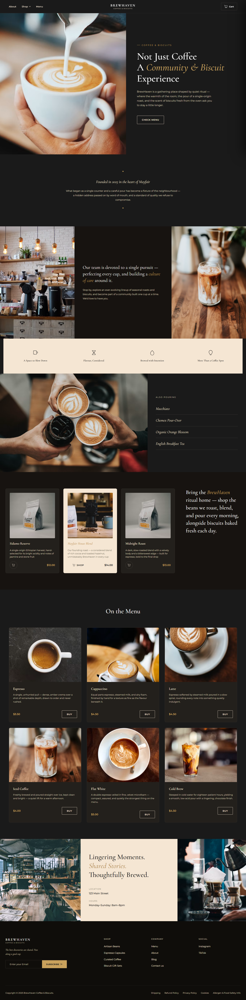

# ☕ BrewHaven - Premium Coffee Shop Website

A luxury coffee shop website built as a learning project to explore modern front-end design, dark-mode aesthetics, and responsive UI/UX principles. BrewHaven presents a fictional Mayfair coffeehouse — its menu, signature blends, and story — through an elegant, dark-luxury interface inspired by premium hospitality and specialty coffee brands.

---

## ✨ Features

- **Responsive Design** — fluid layouts that adapt cleanly across mobile, tablet, and desktop breakpoints (375px–1440px+)
- **Modern UI/UX with Dark Luxury Aesthetic** — charcoal and cream palette with gold accents, Cormorant/Montserrat serif–sans pairing, and generous whitespace
- **Product Showcase** — shop section featuring signature coffee blends with imagery, pricing, and add-to-cart interactions
- **Menu Display** — full drinks menu (Espresso, Cappuccino, Latte, Iced Coffee, Flat White, Cold Brew) with descriptions and pricing
- **Contact Information** — location and hours presented in a dedicated "Lingering Moments" section
- **Newsletter Signup** — footer subscription form with inline email validation and status feedback
- **Mobile-Optimized Layout** — sticky header collapsing into a hamburger menu, touch-friendly tap targets, and a slide-in cart panel
- **Interactive Shopping Cart** — add/remove items, live subtotal, item count badge, and persistence via `localStorage`
- **Accessible Markup** — skip link, semantic landmarks, ARIA attributes on interactive controls, and visible focus states

---

## 🛠️ Technology Stack

| Technology | Purpose |
|---|---|
| **HTML5** | Semantic page structure and accessibility |
| **CSS3** | Custom properties (design tokens), Grid/Flexbox layout, responsive breakpoints, animations |
| **JavaScript (Vanilla ES6+)** | Cart logic, mobile navigation, scroll effects, form handling |
| **UI/UX Pro components** | Design system guidance for color, typography, spacing, and accessibility patterns |

No build tools, frameworks, or external JS libraries are required — the site runs as static files.

---

## 📁 Project Structure

```
Website/
├── index.html              # Main HTML document (all page sections)
├── assets/
│   ├── css/
│   │   └── style.css       # All styles: design tokens, layout, responsive rules
│   └── js/
│       └── main.js         # Cart, navigation, scroll, and form interactivity
└── README.md                # Project documentation
```

---

## 🚀 Installation

No dependencies or build steps are required — BrewHaven is a static HTML/CSS/JS site.

1. **Clone or download** the project:
   ```bash
   git clone <repository-url>
   cd Website
   ```

2. **Open directly in a browser**:
   - Double-click `index.html`, **or**
   - Right-click `index.html` → Open With → your browser

3. **(Recommended) Serve locally** to avoid any relative-path issues:
   ```bash
   # Using Python
   python -m http.server 8080

   # Using Node.js
   npx serve .
   ```
   Then visit `http://localhost:8080` in your browser.

---

## 📖 Usage

- **Navigate** using the sticky header — **About**, **Shop** (dropdown), and **Menu** links jump to their respective sections
- **Browse the Shop** section to view signature coffee blends and add them to your cart
- **View the Menu** to see all six drinks with descriptions and pricing
- **Add items to cart** using the cart icons or "Buy" buttons — the cart panel slides in from the right
- **Checkout** clears the cart (demo only — no real payment is processed)
- **Subscribe** to the newsletter from the footer using a valid email address
- **On mobile**, tap the hamburger icon to open the navigation drawer

---

## 📸 Screenshots



---

## ☁️ Deployment

This project can be deployed as a static site on **Vercel** in minutes:

### Option 1: Vercel CLI
```bash
npm install -g vercel
vercel login
vercel
```
Follow the prompts — Vercel will detect it as a static project automatically.

### Option 2: Vercel Dashboard
1. Push this project to a GitHub repository
2. Go to [vercel.com/new](https://vercel.com/new) and import the repository
3. Leave the build settings default (no build command needed for static HTML)
4. Click **Deploy**

Your site will be live at a `*.vercel.app` URL, with automatic redeploys on every push to the main branch.

---

## 🔮 Future Improvements

- **Backend Integration** — connect the menu, products, and inventory to a real database/API
- **Payment Processing** — integrate Stripe or a similar provider for real checkout functionality
- **User Authentication** — accounts, order history, and saved preferences
- **Blog Section** — articles on brewing methods, bean sourcing, and shop stories
- **CMS Integration** — allow non-technical content updates (menu items, pricing, hours)
- **Online Ordering & Reservations** — table booking and order-ahead functionality
- **Automated Testing** — accessibility and visual regression checks

---


